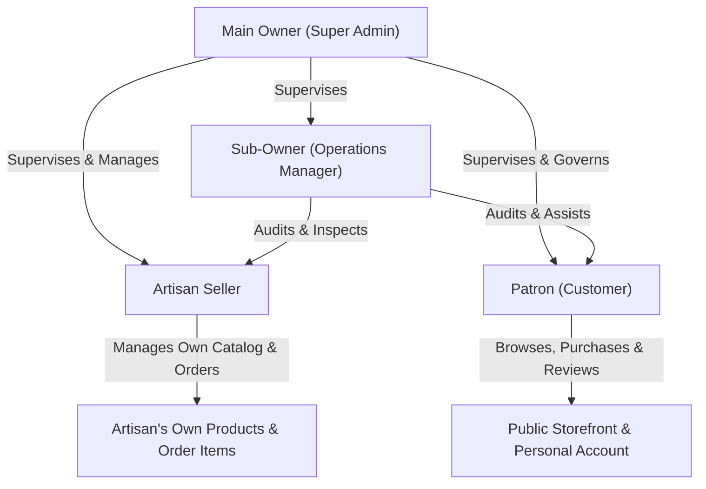

# CraftNest — User Roles & Authentication Architecture

This document specifies the multi-role identity, authorization, role-based access control (RBAC), and session security architecture implemented in the CraftNest platform.

---

## 1. User Roles Matrix & Permission Boundaries

CraftNest enforces four distinct operational roles with strict hierarchical permissions:



| Dimension | Main Owner (`owner` / `admin`) | Sub-Owner (`sub_owner`) | Artisan Seller (`seller`) | Customer (`customer`) |
| :--- | :--- | :--- | :--- | :--- |
| **System Entry** | `/login` (Unified) | `/login` (Unified) | `/login` (Unified) | `/login` (Unified) |
| **Primary Dashboard**| `/owner/dashboard` | `/sub-owner/dashboard` | `/seller/dashboard` | `/account` |
| **Product Creation** | Can create Owner goods or assign to any Seller | Cannot create products directly | Can create products for their own workshop only | No product creation privileges |
| **Product Edit / Delete**| Full unrestricted override over all products | View-only catalog review | Can only modify products where `seller_id == user.id` | None |
| **Order Visibility** | Full view of all marketplace orders (`/api/orders/all`) | Full view of all marketplace orders | Can only view line items where `order_items.seller_id == user.id` | Can only view orders placed by their account |
| **Order Status Update**| Can update status, tracking ID, tracking URL, courier | Supervised viewing; can assist with packing status | View assigned items; packing coordination | Cannot update order statuses |
| **Artisan Management**| Can onboard, edit, block, or delete sellers | Can view sellers & review inventory | Cannot access other sellers | Cannot access seller management |
| **Financial Ledgers** | Full access to transactions, GMV, and refund triggers | Limited operational metrics | Views own sales totals and payouts | Views personal payment receipts |
| **Maintenance Toggles**| Can trigger global maintenance or high-demand queue | Cannot toggle system modes | Cannot toggle system modes | Affected by maintenance mode |

---

## 2. The Unified Login Architecture

Rather than maintaining fragmented, obscure login URLs for different personas, CraftNest provides a **Single Unified Authentication Gateway** at `/login`.

```
                    ┌───────────────────────────────┐
                    │      Unified Login Page       │
                    │         (/login)              │
                    └───────────────┬───────────────┘
                                    │
                                    ▼
                    ┌───────────────────────────────┐
                    │    POST /api/auth/login       │
                    │  (Email/Username + Password)  │
                    └───────────────┬───────────────┘
                                    │
         ┌──────────────────────────┴──────────────────────────┐
         │                                                     │
         ▼                                                     ▼
 1. Check AdminModel                                  2. Check UserModel
    (Internal Admins)                                    (Sellers, Customers, Owners)
         │                                                     │
         ▼                                                     ▼
 Bcrypt Hash Verification                             Bcrypt Hash Verification
         │                                                     │
         ├─► Matches -> Returns role="owner"                   ├─► Checks is_blocked & locked status
         │                                                     ├─► Matches -> Returns user.role
         └──────────────────────────┬──────────────────────────┘
                                    │
                                    ▼
                    ┌───────────────────────────────┐
                    │  Issue 24-hour Bearer JWT     │
                    │  (user_id, is_admin, role)    │
                    └───────────────┬───────────────┘
                                    │
               ┌────────────────────┴────────────────────┐
               │                                         │
               ▼                                         ▼
   Frontend Client Storage                      Role-Based Redirection
   localStorage.setItem('token', jwt)           • Owner -> /owner/dashboard
   localStorage.setItem('user', user)           • Sub-Owner -> /sub-owner/dashboard
   localStorage.setItem('role', role)           • Seller -> /seller/dashboard
                                                • Customer -> /account (or return URL)
```

---

## 3. Detailed Authentication Lifecycles

### 3.1 Customer Registration (Enforced OTP Verification)
> [!IMPORTANT]
> Direct registration via `/api/auth/register` is intentionally disabled to prevent unverified spam accounts.
1. The user fills out the registration form at `/register` (name, email, mobile, password, address).
2. The frontend invokes `POST /api/auth/send-otp`.
3. The backend:
   - Validates email domain restrictions (supports Gmail and Outlook).
   - Verifies email uniqueness in `UserModel`.
   - Hashes the password using `bcrypt.hashpw()`.
   - Generates a 6-digit random code and stores the uncommitted registration state in `otp_verifications` with a 5-minute expiry.
   - Transmits the code to the user via Gmail SMTP.
4. The user is redirected to `/verify-otp`.
5. Upon entering the 6-digit code, the client calls `POST /api/auth/verify-otp`.
6. The backend verifies the code, creates the `UserModel` row with `email_verified = TRUE`, initializes an empty `Cart`, creates the default `DeliveryAddress`, and returns an initial JWT session token.

### 3.2 Login & Account Lockout Throttling
1. The client sends credentials to `POST /api/auth/login`.
2. The server acquires a transactional row lock (`with_for_update()`) on `user_attempts`:
   - Checks if `blocked_until` exceeds current time. If so, rejects with `429 Too Many Requests` ("Too many failed login attempts. Please try again after 15 minutes.").
3. The server tests password with `bcrypt.checkpw()`:
   - **Failure**: Increments `failed_login_attempts`. If failures reach 5, sets `blocked_until = now + 15 minutes` and rejects with `429`. Otherwise, returns `401 Unauthorized`.
   - **Success**: Clears `failed_login_attempts` to `0`, updates `last_login`, commits the database transaction, and signs a 24-hour JWT token.

### 3.3 Password Reset Lifecycle
1. The user navigates to `/forgot-password` and enters their registered email or phone number.
2. The client calls `POST /api/auth/forgot-password`.
3. The backend confirms account existence, checks for rate limits, generates a 6-digit reset code in `otp_verifications`, and sends a reset email.
4. The user enters the code on `/reset-password`. The backend verifies the code via `POST /api/auth/verify-reset-otp`.
5. Upon code verification, the client submits the new password to `POST /api/auth/reset-password`, which salts and hashes the new secret using bcrypt and clears all active OTP records.

---

## 4. Backend Authorization Middleware & Decorators

Authorization is enforced at the controller layer via Python decorators defined in `backend/middleware/auth.py`:

```python
# 1. Any Authenticated User (Customer, Seller, or Admin)
@token_required
def customer_endpoint(current_user):
    ...

# 2. Administrative Role Required (Owner or Admin)
@admin_required
def admin_endpoint(current_user):
    ...

# 3. Super Owner Only
@owner_required
def owner_endpoint(current_user):
    ...

# 4. Artisan Seller or Administrative Supervisor
@seller_required
def seller_endpoint(current_user):
    ...
```

### Authorization Token Resolution Order
The backend extracts the authentication token through a 4-tier fallback:
1. `Authorization: Bearer <token>`
2. Custom HTTP Headers: `X-Access-Token`, `X-Auth-Token`, `X-Admin-Token`
3. WSGI Server Environment: `HTTP_AUTHORIZATION`
4. Browser Cookies: `bb_token`, `token`, `admin_token`

---

## 5. Frontend Route Protection (`ProtectedRoute.jsx`)

On the client side, route security is enforced declaratively using `ProtectedRoute.jsx` wrapped around React Router v7 routes:

```jsx
// Customer Private Area
<Route path="/checkout" element={
  <ProtectedRoute>
    <Checkout />
  </ProtectedRoute>
} />

// Owner Command Center
<Route path="/owner/dashboard" element={
  <ProtectedRoute allowedRoles={['owner', 'admin']}>
    <OwnerDashboard />
  </ProtectedRoute>
} />

// Artisan Portal
<Route path="/seller/dashboard" element={
  <ProtectedRoute allowedRoles={['seller', 'owner', 'admin']}>
    <SellerDashboard />
  </ProtectedRoute>
} />
```

### Enforcement Rules:
1. If `loading` is true: Renders animated `<LoadingSpinner label="Authenticating session..." />`.
2. If `isAuthenticated == false`: Redirects to `/login` with `state: { from: location }` to allow post-login return.
3. If `allowedRoles` does not match the active role: Redirects the user to their authorized portal (`/owner/dashboard`, `/seller/dashboard`, or `/`).

---

## 6. Verification Status & Known Implementation Notes

- **Verified**: Common login with automatic role dispatching is fully operational.
- **Verified**: Bcrypt password hashing and 15-minute lockouts are verified by integration tests.
- **Verified**: Artisan seller isolation is enforced in backend product mutations (403 Forbidden on cross-seller edits).
- **Verified**: Order items retain `seller_id` for accurate workshop attribution.
- **Implementation Note**: OAuth2 (Google & Microsoft) callback routes exist in `backend/routes/auth.py`, but live production OAuth requires valid third-party credentials (`GOOGLE_CLIENT_ID` / `MICROSOFT_CLIENT_ID`) configured in the server environment.
