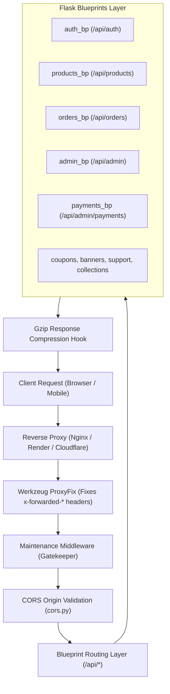
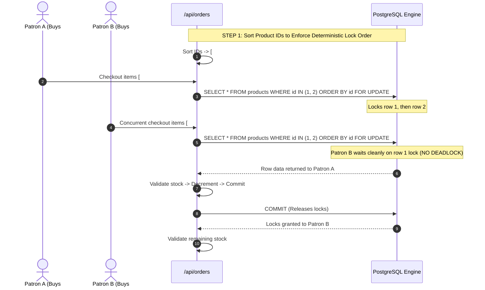

# CraftNest — Backend Architecture & Server Guide

This document describes the server architecture, middleware pipeline, concurrency safety, transactional locking, background reporting, and operational infrastructure of the CraftNest backend.

---

## 1. Architectural Philosophy & Application Factory

The CraftNest backend is implemented in **Python 3** using the **Flask 3.0** microframework. It is designed around modular blueprints, strict transactional integrity, defensive error handling, and robust concurrency management.



---

## 2. Request & Response Processing Pipeline

### 2.1 Reverse Proxy Header Normalization (`ProxyFix`)
In `backend/app.py`:
```python
from werkzeug.middleware.proxy_fix import ProxyFix
app.wsgi_app = ProxyFix(app.wsgi_app, x_for=1, x_proto=1, x_host=1, x_port=1, x_prefix=1)
```
- Ensures client IP addresses, protocol schemes (`https`), hostnames, and ports are correctly preserved behind cloud reverse proxies (e.g., Render, Oracle Cloud, Cloudflare, Nginx).

### 2.2 Global Maintenance Middleware (`backend/middleware/maintenance.py`)
- Evaluates `site_settings` for `maintenance_mode = 'true'`.
- If maintenance mode is active:
  - Whitelists administrative routes (`/api/admin/*`, `/api/auth/login`, `/api/maintenance/*`).
  - Intercepts public customer traffic with `503 Service Unavailable`, preventing state mutations while maintenance is underway.

### 2.3 Gzip Payload Compression
In `backend/app.py`:
```python
@app.after_request
def compress_response(response):
    ...
```
- Compresses any JSON, HTML, JavaScript, or CSS response exceeding 500 bytes using Python's native `gzip` module when the incoming request sends `Accept-Encoding: gzip`.
- Reduces network bandwidth consumption by up to 75% for large catalog payloads.

### 2.4 Defensive Error Handlers
- **404 Not Found (`not_found`)**: Returns structured JSON error payloads for API routes (`/api/*`), including debugging hints in development environments.
- **500 Server Error (`server_error`)**: Sanitizes unhandled server exceptions in production mode to avoid leaking internal stack traces (`{"success": false, "message": "Internal server error."}`).
- **Uncaught Exceptions (`handle_uncaught_exception`)**: Catches all unexpected Python exceptions, logs them with `logging.error(exc_info=True)`, and responds with a uniform 500 status.

---

## 3. Concurrency Protection & Deadlock Elimination

In multi-vendor e-commerce platforms, concurrent order placement for high-demand artisanal items can lead to two severe bugs:
1. **Inventory Overselling (Race Conditions)**: Two patrons buying the last available stock item simultaneously.
2. **Database Deadlocks**: Two transactions locking products in opposite orders (Transaction 1 locks Product A then B; Transaction 2 locks Product B then A).

CraftNest resolves both problems in `backend/routes/orders.py`:



### Implementation Details:
1. **Sorted Lock Acquisition**: All product IDs are deduplicated and strictly sorted (`sorted_product_ids = sorted(list(set(product_ids)))`).
2. **Pessimistic Row Locking (`with_for_update()`)**: Locks the selected product rows inside the database transaction until the order is committed or rolled back.
3. **Atomic Stock Decrement & History Logging**: Simultaneously updates `products.stock` and inserts a matching record into `stock_histories`.

---

## 4. In-Memory Caching Subsystem (`backend/utils/cache.py`)

CraftNest includes an in-memory dictionary-based caching layer with Time-To-Live (TTL) expiration to optimize read performance for static and semi-static catalog data:

| Cache Instance | Purpose | Default TTL | Invalidation Trigger |
| :--- | :--- | :--- | :--- |
| `products_cache` | Cached product listing responses | 120 seconds | Any product creation, update, restock, or deletion |
| `categories_cache`| Category taxonomy tree | 300 seconds | Category creation, modification, or deletion |
| `category_attributes_cache`| Dynamic category specification schema | 600 seconds | Attribute updates |

When any product is modified via `POST /api/products` or `PUT /api/products/<id>`, the cache is instantly cleared:
```python
from backend.utils.cache import categories_cache, products_cache
categories_cache.clear()
products_cache.clear()
```

---

## 5. Automated Background Reporting Scheduler (`backend/utils/report_automation.py`)

CraftNest incorporates an automated reporting engine powered by `pandas` and `openpyxl`:

- **Execution**: Can be triggered on-demand via `POST /api/admin/run-report` or run in a dedicated background worker process via the CLI command:
  ```bash
  flask --app app.py run-report-scheduler
  ```
- **Report Generation**:
  - Compiles monthly Gross Merchandise Value (GMV), net platform revenues, total fulfilled orders, and cancelled returns.
  - Aggregates sales totals broken down by individual artisan workshop.
  - Automatically writes formatted `.xlsx` workbooks into `backend/reports/` (e.g. `BharatBasket_Monthly_Report_June_2026.xlsx`).
  - Optionally transmits reports as email attachments to the Main Owner via Gmail SMTP.

---

## 6. Command-Line Interface (CLI) Commands

The backend exposes dedicated Flask CLI management commands:

| Command | Purpose | Restrictions |
| :--- | :--- | :--- |
| `flask bootstrap-dev` | Automatically generates local SQLite schema (`dev.db`) and runs local seed scripts. | **Disabled in Production** to prevent accidental table drops. Production uses live Neon PostgreSQL. |
| `flask run-report-scheduler` | Spawns the background automated reporting worker thread. | Requires `REPORT_SCHEDULER_ENABLED=true` in environment. |

---

## 7. Logging & Diagnostic Architecture

Logging is configured in `backend/app.py` based on `Config.LOGGING_LEVEL`:
- **Development (`DEV`)**: `DEBUG` level with SQL statement echoing (`SQLALCHEMY_ECHO = True`).
- **Staging (`QA`)**: `INFO` level capturing route hits, authenticated user IDs, and transaction states.
- **Production (`PROD`)**: `WARNING` level to preserve I/O performance and avoid sensitive data leakage.
- **Startup Route Manifest**: On startup, `print_registered_routes(app)` outputs a complete formatted table of every registered URL rule and HTTP verb to the system console.
