# CraftNest — Database Architecture & Schema Documentation

## 1. Architectural Model & Database Connectivity

### Single Unified Database Model (Crucial Architecture Finding)
> [!IMPORTANT]
> **No Separate Databases Exist**: In the actual CraftNest codebase, there are **no separate physical databases** for the Main Owner, Sellers, or Customers.
> 
> Instead, CraftNest employs an enterprise **Single Unified Relational Database Architecture** (hosted on **Neon Serverless PostgreSQL** in QA/Production, with an embedded **SQLite 3** fallback in local development). 
>
> Tenant isolation between artisans is achieved via **relational foreign keys and query-level filtering**:
> - Each artisan is registered as a row in the `users` table with `role = 'seller'`.
> - Each product created by an artisan holds `products.seller_id = users.id`. Products created by the Main Owner hold `products.seller_id = NULL`.
> - In orders, each order item row in `order_items` maintains an explicit `seller_id` foreign key referencing the artisan.
> - Artisan queries (e.g., `OrderModel.find_by_seller_id()` and `ProductModel.update_product()`) strictly filter by the authenticated artisan's `seller_id`.

### Connection Configuration
- **Engine**: SQLAlchemy 2.x via `Flask-SQLAlchemy` (v3.1.1).
- **Driver**: `psycopg2-binary` for PostgreSQL; standard `sqlite3` for local dev.
- **URI Formats**:
  - Production / QA: `postgresql://<user>:<password>@<neon-host>.neon.tech/<dbname>?sslmode=require`
  - Development Fallback: `sqlite:////<project-root>/backend/dev.db`
- **Engine Pool Settings**:
  - `pool_pre_ping = True` (Tests liveness before reusing connections)
  - `pool_recycle = 280` (Recycles idle connections every 280 seconds before Neon auto-terminates)
  - `pool_size = 10`
  - `max_overflow = 5`
  - `pool_timeout = 30`

---

## 2. Complete Entity-Relationship (ER) Diagram

```mermaid
erDiagram
    users ||--o{ delivery_addresses : "has many"
    users ||--o| carts : "has one"
    users ||--o{ wishlists : "has many"
    users ||--o{ orders : "places many"
    users ||--o{ reviews : "writes many"
    users ||--o{ products : "sells many (seller_id)"
    users ||--o{ order_items : "fulfills many (seller_id)"
    users ||--o{ support_messages : "submits many"
    users ||--o{ user_attempts : "has one security lock"
    users ||--o{ user_status_audit_logs : "audited by"
    users ||--o{ buy_requests : "requests"

    categories ||--o{ products : "contains many"
    categories ||--o| category_banners : "has one banner"

    collections ||--o{ products : "groups many"
    collections ||--o| collection_banners : "has one banner"

    carts ||--o{ cart_items : "contains"
    products ||--o{ cart_items : "referenced in"
    products ||--o{ wishlists : "referenced in"
    products ||--o{ product_images : "has ordered media"
    products ||--o{ product_variants : "has variants"
    products ||--o{ stock_histories : "logs adjustments"
    products ||--o{ product_audit_logs : "logs audits"
    products ||--o{ reviews : "receives"
    products ||--o{ order_items : "ordered as"

    orders ||--o{ order_items : "consists of"
    orders ||--o{ transactions : "paid via"
    users ||--o{ transactions : "initiated by"

    support_messages ||--o{ support_replies : "contains conversation"

    admins ||--o{ admin_audit_logs : "records actions"
    admins ||--o{ admin_notifications : "receives"
```

---

## 3. Comprehensive Table Schema Reference

### 3.1 Identity & User Management

#### Table: `users`
Represents all system personas: Customers, Artisans (Sellers), Sub-Owners, and Administrators.
| Column | Type | Constraints | Description |
| :--- | :--- | :--- | :--- |
| `id` | `INTEGER` | PK, Auto Increment | Unique internal system user identifier. |
| `full_name` | `EncryptedString(255)` | NOT NULL | Patron/Seller name. Stored encrypted with AES-256-CBC. |
| `email` | `EncryptedString(255)` | UNIQUE, NOT NULL, Index | Registered email. Stored encrypted with deterministic IV for lookups. |
| `password_hash` | `VARCHAR(255)` | NOT NULL | Secure salted bcrypt password hash. |
| `phone` | `EncryptedString(255)` | NULL | Mobile contact number. Encrypted with AES-256-CBC. |
| `notifications` | `JSON` | Default `[]` | In-app user notifications array. |
| `is_blocked` | `BOOLEAN` | Default `FALSE` | Administrative suspension flag. |
| `is_admin` | `BOOLEAN` | Default `FALSE` | Boolean administrator flag. |
| `role` | `VARCHAR(50)` | Default `'customer'` | Role identifier: `'customer'`, `'seller'`, `'owner'`, `'sub_owner'`, `'admin'`. |
| `email_verified` | `BOOLEAN` | Default `FALSE` | Email OTP verification status. |
| `created_at` | `DATETIME` | Default `IST Now` | Timestamp of account creation. |
| `updated_at` | `DATETIME` | Auto-update `IST Now` | Timestamp of last profile update. |
| `microsoft_id` | `VARCHAR(100)` | UNIQUE, NULL | External Microsoft OAuth identifier. |
| `provider` | `VARCHAR(50)` | Default `'local'` | Authentication source (`'local'`, `'google'`, `'microsoft'`). |
| `provider_id` | `VARCHAR(255)` | UNIQUE, NULL | External OAuth provider subject identifier. |
| `last_login` | `DATETIME` | NULL | Timestamp of the most recent successful login. |
| `preferred_language`| `VARCHAR(10)` | NULL | User localization code (`'en'`, `'hi'`). |
| `first_login` | `BOOLEAN` | Default `TRUE` | Used to trigger welcome or language setup modals. |

#### Table: `delivery_addresses`
Physical shipping addresses attached to patron profiles.
| Column | Type | Constraints | Description |
| :--- | :--- | :--- | :--- |
| `id` | `INTEGER` | PK, Auto Increment | Unique address identifier. |
| `user_id` | `INTEGER` | FK `users.id` (CASCADE), NOT NULL | Owning patron ID. |
| `house_number` | `EncryptedString(255)` | Default `""` | House/Flat/Apartment number (AES-256 encrypted). |
| `building_name` | `EncryptedString(255)` | Default `""` | Building/Tower name (AES-256 encrypted). |
| `street` | `EncryptedString(500)` | Default `""` | Street or road name (AES-256 encrypted). |
| `area` | `EncryptedString(500)` | Default `""` | Locality or sector (AES-256 encrypted). |
| `landmark` | `EncryptedString(500)` | Default `""` | Nearby landmark (AES-256 encrypted). |
| `city` | `EncryptedString(255)` | Default `""` | City (AES-256 encrypted). |
| `state` | `EncryptedString(255)` | Default `""` | State/Province (AES-256 encrypted). |
| `pincode` | `EncryptedString(255)` | Default `""` | Postal PIN code (AES-256 encrypted). |
| `address_type` | `VARCHAR(50)` | Default `'Home'` | Address label (`'Home'`, `'Work'`, `'Other'`). |
| `alternate_mobile_number`| `VARCHAR(15)` | NULL | Optional backup phone number. |
| `country` | `EncryptedString(255)` | Default `'India'` | Country name. |
| `is_default` | `BOOLEAN` | Default `FALSE` | Indicates the primary checkout address. |
| `created_at` | `DATETIME` | Default `IST Now` | Address creation timestamp. |

#### Table: `user_attempts`
Brute-force security and rate limiting table.
| Column | Type | Constraints | Description |
| :--- | :--- | :--- | :--- |
| `id` | `INTEGER` | PK, Auto Increment | Unique record ID. |
| `user_id` | `INTEGER` | FK `users.id` (CASCADE), UNIQUE, Index | Monitored user account ID. |
| `failed_login_attempts`| `INTEGER` | Default `0`, NOT NULL | Counter of consecutive bad passwords. |
| `otp_request_attempts` | `INTEGER` | Default `0`, NOT NULL | Counter of rapid OTP requests. |
| `first_failed_at` | `DATETIME` | NULL | First failure timestamp in the current window. |
| `last_failed_at` | `DATETIME` | NULL | Most recent failure timestamp. |
| `blocked_at` | `DATETIME` | NULL | Timestamp when 15-minute lock was enforced. |
| `blocked_until` | `DATETIME` | NULL | Future timestamp when account unlocks. |
| `reason` | `VARCHAR(50)` | NULL | Lock reason (`LOGIN_FAILED_ATTEMPTS`, `FORGOT_PASSWORD_OTP_LIMIT`). |
| `updated_at` | `DATETIME` | Default `IST Now` | Record update timestamp. |

---

### 3.2 Product Catalog & Inventory Management

#### Table: `categories`
Product classifications (e.g., Blue Pottery, Tanjore Paintings, Brassware).
| Column | Type | Constraints | Description |
| :--- | :--- | :--- | :--- |
| `id` | `INTEGER` | PK, Auto Increment | Category ID. |
| `name` | `VARCHAR(100)` | UNIQUE, NOT NULL | Standard canonical name. |
| `name_en` | `VARCHAR(100)` | NULL | English localized title. |
| `name_hi` | `VARCHAR(100)` | NULL | Hindi localized title. |
| `image_url` | `VARCHAR(500)` | NULL | Visual thumbnail image URL. |
| `created_at` | `DATETIME` | Default `IST Now` | Creation timestamp. |

#### Table: `products`
The core catalog entity holding all artisanal and owner-created goods.
| Column | Type | Constraints | Description |
| :--- | :--- | :--- | :--- |
| `id` | `INTEGER` | PK, Auto Increment | Product primary key. |
| `name` | `VARCHAR(255)` | NOT NULL | Default product title. |
| `price` | `NUMERIC(10, 2)` | NOT NULL | Base listing price in INR. |
| `discount` | `NUMERIC(5, 2)` | Default `0.00` | Percentage discount (0-100%). |
| `description` | `TEXT` | NULL | Detailed narrative description. |
| `images` | `JSON` | NULL | Array of image URLs (fallback if `product_images` is empty). |
| `stock` | `INTEGER` | Default `0` | Available inventory count. |
| `category_id` | `INTEGER` | FK `categories.id` (SET NULL) | Associated category ID. |
| **`seller_id`** | `INTEGER` | FK `users.id` (SET NULL), Index | **Artisan Owner ID (`NULL` if Main Owner)**. |
| `collection_id`| `INTEGER` | FK `collections.id` (SET NULL)| Associated collection grouping. |
| `ratings` | `NUMERIC(3, 2)` | Default `5.00` | Current aggregate rating (1.00 - 5.00). |
| `created_at` | `DATETIME` | Default `IST Now` | Creation timestamp. |
| `updated_at` | `DATETIME` | Auto-update `IST Now` | Last modified timestamp. |
| `created_by` | `VARCHAR(255)` | Default `'admin'` | Creator username or name for auditing. |
| `modified_by` | `VARCHAR(255)` | Default `'admin'` | Last modifying username or name. |
| `status` | `VARCHAR(50)` | Default `'active'` | Listing status (`'active'`, `'inactive'`). |
| `show_on_homepage`| `BOOLEAN` | Default `FALSE` | Featured on homepage highlight grid. |
| `name_en` / `name_hi`| `VARCHAR(255)`| NULL | English and Hindi titles. |
| `description_en` / `description_hi`| `TEXT`| NULL | English and Hindi descriptions. |
| `features_en` / `features_hi`| `TEXT`| NULL | Bulleted highlights (multilingual). |
| `specifications_en` / `specifications_hi`| `TEXT`| NULL | Material/weight specs (multilingual). |

#### Table: `product_images`
Ordered media gallery for product photography.
| Column | Type | Constraints | Description |
| :--- | :--- | :--- | :--- |
| `id` | `INTEGER` | PK, Auto Increment | Image ID. |
| `product_id` | `INTEGER` | FK `products.id` (CASCADE), NOT NULL | Parent product ID. |
| `image_url` | `VARCHAR(512)` | NOT NULL | Cloudinary or static image URL. |
| `image_order` | `INTEGER` | Default `0`, NOT NULL | Display sort order index (0 is primary). |
| `created_at` | `DATETIME` | Default `IST Now` | Upload timestamp. |

#### Table: `stock_histories`
Audit ledger tracking every inventory increment or decrement.
| Column | Type | Constraints | Description |
| :--- | :--- | :--- | :--- |
| `id` | `INTEGER` | PK, Auto Increment | Log entry ID. |
| `product_id` | `INTEGER` | FK `products.id` (CASCADE), NOT NULL | Targeted product ID. |
| `change_type` | `VARCHAR(50)` | NOT NULL | Trigger event (`'order_placed'`, `'manual_adjustment'`). |
| `change_amount`| `INTEGER` | NOT NULL | Stock delta (e.g. `-1` on purchase, `+10` on restock). |
| `old_stock` | `INTEGER` | NOT NULL | Inventory count prior to modification. |
| `new_stock` | `INTEGER` | NOT NULL | Inventory count following modification. |
| `created_at` | `DATETIME` | Default `IST Now` | Event timestamp. |

---

### 3.3 Order Management & Transactions

#### Table: `orders`
Master order record for a patron purchase.
| Column | Type | Constraints | Description |
| :--- | :--- | :--- | :--- |
| `id` | `INTEGER` | PK, Auto Increment | Internal sequential order ID. |
| `order_id` | `VARCHAR(50)` | UNIQUE, NOT NULL, Index | Patron-facing order identifier (e.g. `SS-849201`). |
| `user_id` | `INTEGER` | FK `users.id` (SET NULL) | Purchasing customer ID. |
| `total_amount` | `NUMERIC(10, 2)`| NOT NULL | Total payable order sum in INR. |
| `order_status` | `VARCHAR(50)` | Default `'Pending'` | Milestone status (`Pending`, `Confirmed`, `Packed`, `Shipped`, `Out for Delivery`, `Delivered`, `Cancelled`). |
| `delivery_date`| `VARCHAR(50)` | NULL | Estimated or finalized delivery date. |
| `tracking_history`| `JSON` | NULL | Append-only list of status update objects with timestamps. |
| `return_request`| `JSON` | NULL | Return state object (`status`, `reason`, `message`, `admin_message`). |
| `shipping_address`| `EncryptedJSON`| NULL | Complete delivery address snapshot encrypted with AES-256. |
| `carrier` | `VARCHAR(100)`| NULL | Logistics partner name (e.g. Blue Dart, India Post). |
| `tracking_id` | `VARCHAR(100)`| NULL | Waybill or consignment tracking code. |
| `tracking_url` | `VARCHAR(500)`| NULL | Web URL for external courier live tracking. |
| `terms_accepted`| `BOOLEAN` | Default `FALSE` | Compliance acknowledgment flag. |
| `terms_accepted_at`| `DATETIME` | NULL | Timestamp of legal agreement acceptance. |
| `created_at` | `DATETIME` | Default `IST Now` | Order placement timestamp. |

#### Table: `order_items`
Individual line items inside an order, attributed to specific artisan sellers.
| Column | Type | Constraints | Description |
| :--- | :--- | :--- | :--- |
| `id` | `INTEGER` | PK, Auto Increment | Order line item ID. |
| `order_id` | `INTEGER` | FK `orders.id` (CASCADE), NOT NULL | Parent order reference. |
| `product_id` | `INTEGER` | FK `products.id` (SET NULL) | Purchased product ID. |
| **`seller_id`** | `INTEGER` | FK `users.id` (SET NULL), Index | **Attributed Artisan Seller ID (`NULL` if Owner)**. |
| `quantity` | `INTEGER` | Default `1`, NOT NULL | Units purchased. |
| `price` | `NUMERIC(10, 2)`| NOT NULL | Locked unit price at time of checkout. |
| `name` | `VARCHAR(255)` | NOT NULL | Product name snapshot at purchase time. |
| `image` | `VARCHAR(500)` | NULL | Product thumbnail image URL snapshot. |

#### Table: `transactions`
Payment gateway processing records and audit ledger.
| Column | Type | Constraints | Description |
| :--- | :--- | :--- | :--- |
| `id` | `BIGINT` | PK, Auto Increment | Transaction primary key. |
| `transaction_id`| `VARCHAR(100)`| UNIQUE, NOT NULL, Index | Platform transaction reference. |
| `order_id` | `INTEGER` | FK `orders.id` (SET NULL), Index | Associated order reference. |
| `customer_id` | `INTEGER` | FK `users.id` (SET NULL), Index | Paying customer ID. |
| `payment_gateway`| `VARCHAR(50)` | Default `'razorpay'` | Gateway engine (`'razorpay'`, `'cod'`). |
| `gateway_order_id`| `VARCHAR(100)`| NULL | Gateway-issued order reference. |
| `gateway_payment_id`| `VARCHAR(100)`| NULL | Gateway-issued capture reference. |
| `payment_method`| `VARCHAR(50)` | NULL | Payment instrument (`'card'`, `'upi'`, `'netbanking'`, `'cod'`). |
| `amount` | `NUMERIC(10, 2)`| NOT NULL | Total transacted amount. |
| `currency` | `VARCHAR(10)` | Default `'INR'` | Currency denomination. |
| `payment_status`| `VARCHAR(50)` | Index, Default `'pending'`| Gateway status (`'pending'`, `'authorized'`, `'captured'`, `'failed'`, `'refunded'`). |
| `transaction_status`| `VARCHAR(50)`| Default `'created'` | Pipeline status (`'created'`, `'processing'`, `'completed'`, `'failed'`). |
| `gateway_response`| `JSON` | NULL | Raw JSON webhook payload from gateway. |
| `failure_reason`| `TEXT` | NULL | Explicit decline error code or message. |
| `refunded_amount`| `NUMERIC(10, 2)`| Default `0.00` | Refunded portion if return approved. |
| `environment` | `VARCHAR(20)` | Default `'DEV'` | Environment badge (`'DEV'`, `'QA'`, `'PROD'`). |
| `webhook_verified`| `BOOLEAN` | Default `FALSE` | Cryptographic signature validity status. |
| `payment_time` | `DATETIME` | Index, NULL | Actual gateway capture timestamp. |
| `created_at` / `updated_at`| `DATETIME`| Default `UTC Now` | Auditing timestamps. |

---

### 3.4 Support, Banners, Collections & Administrative Auditing

#### Table: `admins`
Internal administrative authentication credentials for system managers.
| Column | Type | Constraints | Description |
| :--- | :--- | :--- | :--- |
| `id` | `INTEGER` | PK, Auto Increment | Admin account ID. |
| `username` | `EncryptedString(255)`| UNIQUE, NOT NULL | Administrator username (AES-256 encrypted). |
| `password` | `VARCHAR(255)` | NOT NULL | Salted bcrypt administrative password hash. |
| `created_at` | `DATETIME` | Default `IST Now` | Creation timestamp. |

#### Table: `admin_audit_logs`
Tamper-evident record of all administrative actions.
| Column | Type | Constraints | Description |
| :--- | :--- | :--- | :--- |
| `id` | `INTEGER` | PK, Auto Increment | Audit log ID. |
| `admin_username`| `VARCHAR(100)`| NOT NULL | Username of administrator who executed the action. |
| `action_type` | `VARCHAR(100)`| NOT NULL | Type (`'Product Added'`, `'Stock Update'`, `'Order Status Updated'`). |
| `module` | `VARCHAR(100)`| NOT NULL | Section (`'Product Management'`, `'Order Fulfillment'`). |
| `details` | `TEXT` | NULL | Freeform description of changes executed. |
| `status` | `VARCHAR(50)` | Default `'Success'` | Outcome of operation. |
| `created_at` | `DATETIME` | Default `IST Now` | Action execution timestamp. |

#### Additional Implemented Tables
- **`collections`**: Themed groups with desktop/mobile banner images, styling tips, rules, and slug.
- **`category_banners`** & **`collection_banners`**: Promotional visual assets linked directly to categories/collections with action button links.
- **`lookbooks`**: High-fashion craft presentations with item tags, descriptions, and JSON detail arrays.
- **`support_messages`** & **`support_replies`**: Multi-turn customer care ticketing system with email notifications.
- **`faqs`** & **`support_links`**: Informational knowledge base entries and emergency contact options.
- **`coupons`**: Discount coupons supporting percentage or flat currency deductions with minimum basket sizes.
- **`otp_verifications`**: Transient storage for 6-digit registration and password reset tokens with 5-minute expiry.
- **`site_settings`**: Global persistent key-value configuration table.
- **`email_logs`**: System audit trail of all outbound SMTP messages.
