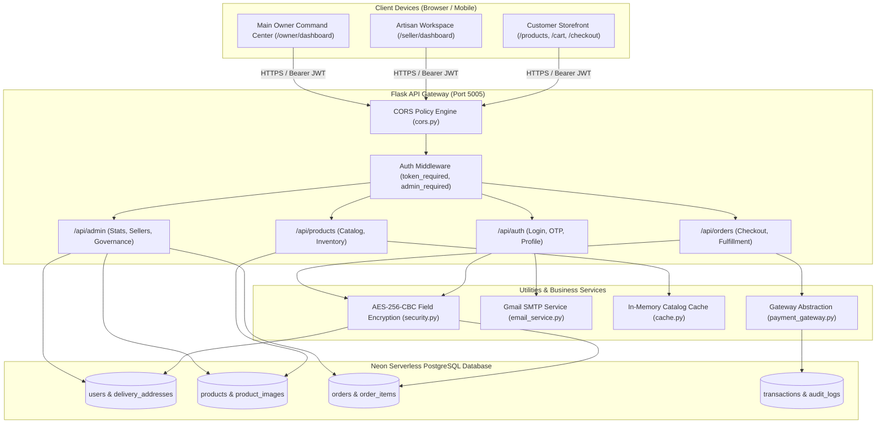
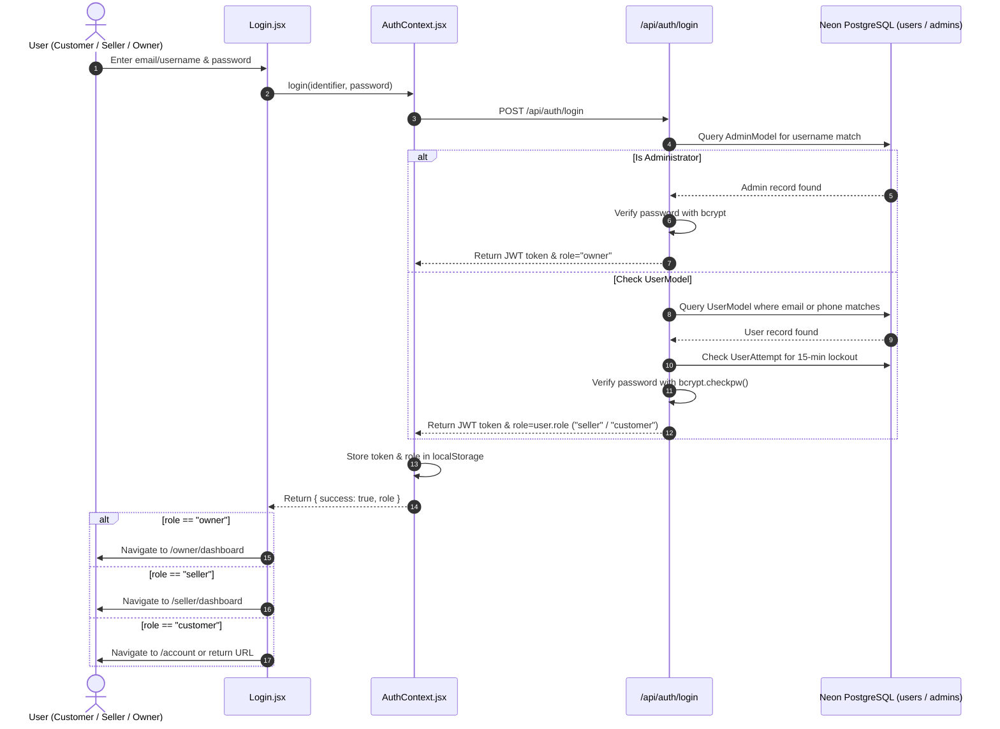
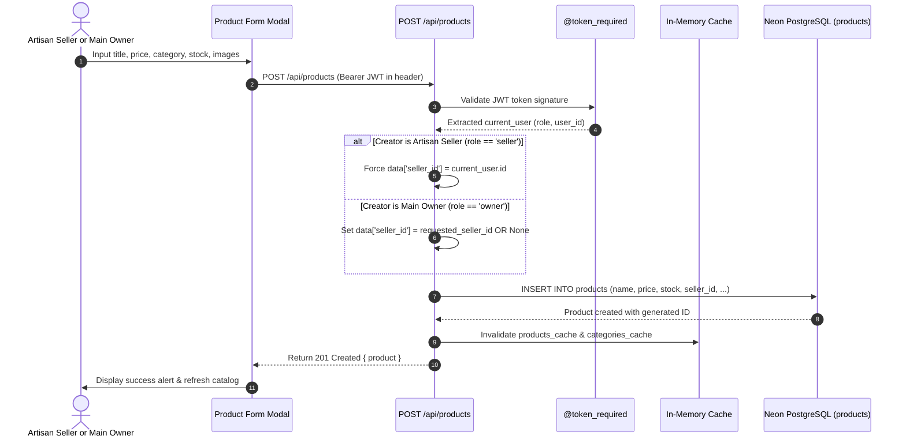
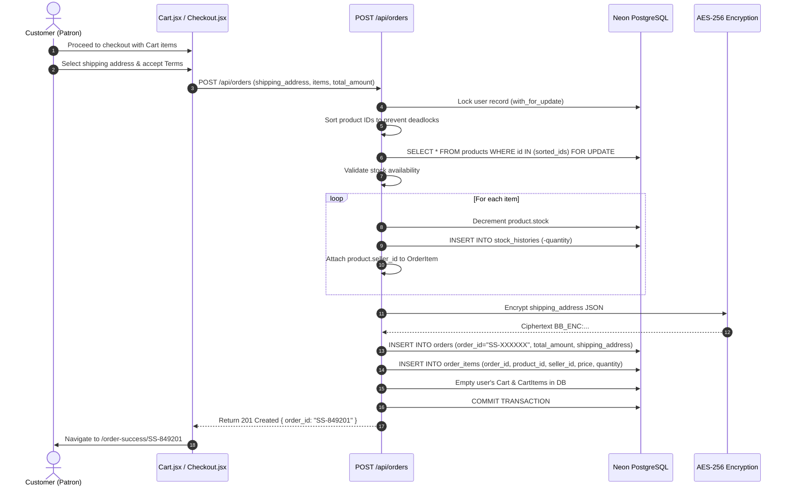
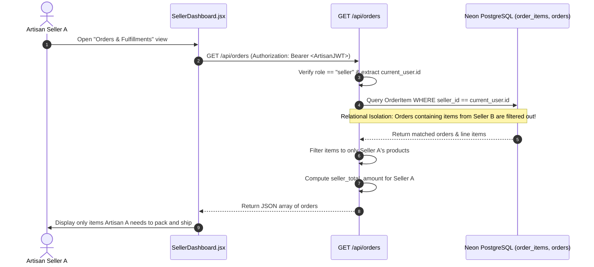
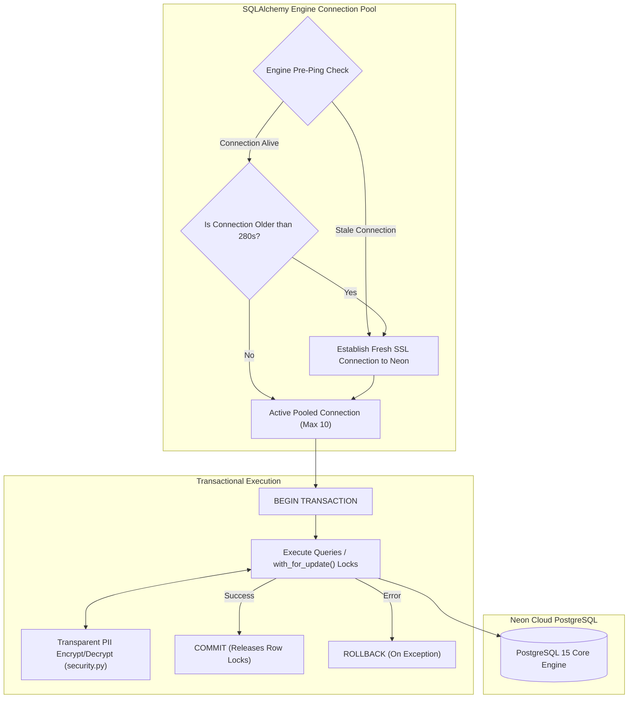

# CraftNest — Application Workflows & Complete Data Flow

This document details how data moves through the CraftNest ecosystem across user interactions, API communications, transactional boundaries, and database persistence.

---

## 1. High-Level System Architecture & Component Interactions

---

## 2. Authentication & Unified Role Redirection Flow

---

## 3. Product Creation Lifecycle (Artisan vs Owner)

---

## 4. Customer Purchase & Multi-Seller Order Flow

---

## 5. Seller Order Management & Isolation Flow

---

## 6. Database Communication & Connection Pool Lifecycle

