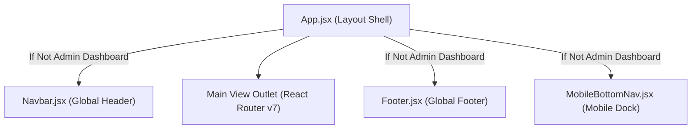

# CraftNest — Frontend Client Architecture & Page Reference

The CraftNest frontend is an enterprise React 19 Single Page Application (SPA) styled with Tailwind CSS v4 and custom design tokens. It delivers responsive layouts optimized for mobile smartphones, tablets, and wide-screen desktops.

---

## 1. Global Navigation & Layout Architecture

### 1.1 Global Header (`frontend/src/components/common/Navbar.jsx`)
- **Purpose**: Provides sticky top navigation, brand identity, full-text catalog search, localized language toggle (EN/HI), real-time cart and wishlist item count badges, and dynamic user profile shortcuts.
- **Key Features**:
  - **Dynamic Authentication State**: Automatically changes action buttons between "Sign In" and a personalized user dropdown (linking to `/account`, `/orders`, or `/owner/dashboard`).
  - **Live Search Modal**: Typeahead product search linking to `/search?q=...`.
  - **Language Selector**: Seamlessly toggles between English and Hindi, broadcasting changes across the catalog.
  - **Badge Counters**: Synchronized with `CartContext` and `WishlistContext`.

### 1.2 Global Footer (`frontend/src/components/common/Footer.jsx`)
- **Purpose**: Provides institutional credibility, heritage artisanal provenance story, artisan onboarding call-to-actions, category shortcuts, customer care links, and social links.

### 1.3 Mobile Bottom Navigation Dock (`frontend/src/components/common/MobileBottomNav.jsx`)
- **Purpose**: App-like thumb navigation fixed at the bottom of smartphone viewports (`< 768px`).
- **Icons & Destinations**: Home (`/`), Catalog (`/products`), Wishlist (`/wishlist`), Cart (`/cart`), and Account (`/account` or `/login`).

---

## 2. Storefront & Patron Pages

### 2.1 Home Page (`frontend/src/pages/Home.jsx`)
- **Route**: `/`
- **Purpose**: Immersive flagship landing page highlighting regional artisan traditions, curated collections, hero promotion banners, and high-demand crafts.
- **Key Components Used**:
  - `CategoryBanner.jsx`, `CollectionBanner.jsx`, `ProductCard.jsx`, `LuxuryGallery.jsx`, `TrustShowcase.jsx`, `OccasionGallery.jsx`.
- **Data Displayed**:
  - Hero slider loaded from `/api/banners`.
  - Featured categories with counts from `/api/products/categories`.
  - Curated seasonal collections from `/api/collections`.
  - Highest-rated handcrafted listings from `/api/products?featured=true`.
- **User Interactions**: Direct carousel sliding, collection drill-downs, quick add-to-cart, wishlist toggle, video modal playback.

### 2.2 Product Catalog & Search (`frontend/src/pages/Products.jsx`)
- **Routes**: `/products`, `/search`, `/category/:categorySlug`, `/categories`
- **Purpose**: Comprehensive filterable marketplace catalog.
- **Components Used**: `ProductCard.jsx`, `Badge.jsx`, `EmptyState.jsx`, `LoadingSpinner.jsx`.
- **Filters & Controls**:
  - Faceted category selection sidebar.
  - Price range slider (₹0 - ₹50,000+).
  - Discount filter (e.g. 10%+, 20%+).
  - Sort order dropdown (Featured, Price: Low to High, Price: High to Low, Rating).
  - Pagination navigation controls.
- **API Connections**: Calls `GET /api/products` with query params (`page`, `limit`, `category`, `search`, `sort`, `min_price`, `max_price`).

### 2.3 Product Details Page (`frontend/src/pages/ProductDetails.jsx`)
- **Routes**: `/products/:id`, `/product/:id`
- **Purpose**: Rich informational showcase of an individual handcrafted item.
- **Data Displayed**:
  - High-res photo gallery with thumbnail switcher and zoom preview.
  - Artisan attribution badge (`seller_name`), confirming workshop origin.
  - Pricing, calculated discount savings, tax inclusion notes.
  - Real-time stock status indicator ("In Stock", "Only X Left", "Out of Stock").
  - Tabbed information: Product Description, Craft Features, Physical Specifications.
  - Customer reviews breakdown with aggregate star ratings.
  - Related artisan recommendations.
- **Interactions**:
  - Quantity counter selector.
  - "Add to Cart" and "Buy Now" (direct checkout progression).
  - High-demand "Request to Buy" modal for custom or backordered pieces (`POST /api/products/<id>/request-buy`).
  - Review submission modal with star rating and comment (`POST /api/products/<id>/review`).

### 2.4 Shopping Cart (`frontend/src/pages/Cart.jsx`)
- **Route**: `/cart`
- **Purpose**: Review selected artisanal items, adjust quantities, apply promotional coupons, and compute basket totals.
- **Components Used**: `Button.jsx`, `EmptyState.jsx`.
- **Key Features**:
  - Multi-artisan item grouping.
  - Real-time coupon validation against `POST /api/coupons/validate`.
  - "Save for Later" shelf allowing items to be moved out of active checkout without deletion.
  - Subtotal, estimated shipping, discount deduction, and grand total calculations.

### 2.5 Multi-Step Checkout (`frontend/src/pages/Checkout.jsx`)
- **Routes**: `/checkout`, `/checkout/address`, `/checkout/payment`
- **Guarded By**: `ProtectedRoute` (Authentication mandatory).
- **Purpose**: Secure customer checkout with delivery address selection, terms compliance, and order commitment.
- **Workflow**:
  1. **Step 1: Delivery Address Selection**: Choose from saved addresses (`GET /api/auth/addresses`) or fill in an encrypted new address form.
  2. **Step 2: Order Review**: Review order line items, artisan sources, and delivery estimate.
  3. **Step 3: Legal Terms Acceptance**: Mandatory checkbox confirming acceptance of platform terms.
  4. **Step 4: Commit Order**: Dispatches `POST /api/orders` to execute atomic stock decrement and order generation.
  5. **Step 5: Completion**: Redirects to `/order-success/:orderId`.

### 2.6 Order Success & Details
- **`OrderSuccess.jsx` (`/order-success/:orderId`)**:
  - Displays generated order code (e.g. `SS-849201`), delivery schedule, payment status, and link to download receipt or track live order.
- **`OrderDetails.jsx` (`/orders/:orderId`, `/account/orders/:orderId`)**:
  - Complete vertical tracking stepper showing milestone status changes (`Pending` -> `Confirmed` -> `Packed` -> `Shipped` -> `Out for Delivery` -> `Delivered`).
  - Logistics courier name, consignment number, and clickable external tracking link.
  - Line items breakdown with artisan attribution.
  - Return request submission form (`POST /api/orders/<id>/return`) with reason dropdown and message.

### 2.7 Patron Account Hub (`frontend/src/pages/Account.jsx`)
- **Routes**: `/account`, `/account/*`
- **Guarded By**: `ProtectedRoute`.
- **Purpose**: Unified patron dashboard with tabbed sub-views:
  - **Profile (`Profile.jsx`)**: Update personal name, email, mobile, and reset password.
  - **Orders (`Orders.jsx`)**: Complete order history cards with status pills and tracking triggers.
  - **Wishlist (`Wishlist.jsx`)**: Saved items grid with direct "Move to Cart" button.
  - **Addresses (`/account/addresses`)**: Address book management with default assignment.
  - **Settings (`/account/settings`)**: Localization preference and "Delete Account" anonymization trigger.

---

## 3. Main Owner Administration Hub (`/owner/*`)

The Main Owner area is protected by `<ProtectedRoute allowedRoles={['owner', 'admin']}>` and wrapped inside a modern sidebar layout (`DashboardLayout.jsx`).

| Page View | Route | Primary Capabilities |
| :--- | :--- | :--- |
| **`OwnerDashboard.jsx`** | `/owner/dashboard` | High-level metrics: GMV, Total Orders, Active Artisans, Total Customers, Low Stock alerts, and recent transactions. |
| **`OwnerProducts.jsx`** | `/owner/products` | Master catalog editor. Manage all listings, adjust prices, edit descriptions, toggle homepage visibility, and restock. |
| **`OwnerOrders.jsx`** | `/owner/orders` | Comprehensive order table. Inspect items, modify milestone statuses, inject tracking numbers and courier URLs. |
| **`OwnerCategories.jsx`**| `/owner/categories` | Create, edit, and organize product categories with visual image banners. |
| **`OwnerSellers.jsx`** | `/owner/sellers` | Onboard new artisan sellers, inspect store metrics, adjust verification states, and view performance breakdowns. |
| **`SellerDetails.jsx`** | `/owner/sellers/:id`| Deep audit of a specific artisan's catalog, stock levels, sales volume, and customer reviews. |
| **`OwnerCustomers.jsx`** | `/owner/customers` | Customer directory. View patron purchase history, frequency, and toggle administrative suspensions (block/unblock). |
| **`OwnerPayments.jsx`** | `/owner/payments` | Financial transactions ledger (`/api/admin/payments`). Inspect payment gateways, verify webhook statuses, and trigger refunds. |
| **`OwnerInventory.jsx`** | `/owner/inventory` | Critical inventory control. Highlights out-of-stock and low-stock items with quick inline replenishment inputs. |
| **`OwnerReports.jsx`** | `/owner/reports` | Automated monthly reporting dashboard. Preview financial metrics and trigger on-demand Excel `.xlsx` report downloads. |
| **`OwnerControl.jsx`** | `/owner/control` | Emergency controls: toggle global Maintenance Mode on/off or activate High-Demand traffic queuing. |
| **`OwnerSettings.jsx`** | `/owner/settings` | System-wide settings: Gmail SMTP configuration test, feature flags, and administrative password updates. |

---

## 4. Artisan Seller Portal (`/seller/*`)

Protected by `<ProtectedRoute allowedRoles={['seller', 'owner', 'admin']}>`. Designed specifically for craftspeople to manage their independent workshops.

| Page View | Route | Primary Capabilities |
| :--- | :--- | :--- |
| **`SellerDashboard.jsx`** | `/seller/dashboard` | Workshop overview: Artisan's total sales, pending items to fulfill, active listings count, and product creation modal. |
| **`SellerDashboard.jsx`** | `/seller/products` | Artisan's private product catalog. Create, edit, and adjust inventory for their own items only. |
| **`SubOwnerDashboard.jsx`**| `/seller/orders` | Fulfillments view showing orders containing items originating from this artisan's workshop. |
| **`SellerProfile.jsx`** | `/seller/profile` | Artisan biography, craft lineage, workshop location, and public-facing profile editor. |
| **`SellerReviews.jsx`** | `/seller/reviews` | Direct customer reviews and star ratings received on the artisan's products. |
| **`SellerSettings.jsx`** | `/seller/settings` | Workshop operational preferences and notification settings. |

---

## 5. Sub-Owner Operations Workspace (`/sub-owner/*`)

Protected by `<ProtectedRoute allowedRoles={['sub_owner', 'owner', 'admin']}>`.
- **`SubOwnerDashboard.jsx` (`/sub-owner/dashboard`)**: Provides daily operational supervision over orders, stock replenishment, and artisan fulfillment monitoring without granting access to sensitive financial ledgers or platform configuration switches.

---

## 6. Shared Common Components & Design System

- **`Button.jsx`**: Polymorphic button supporting `variant="primary"`, `variant="secondary"`, `variant="outline"`, and `variant="danger"`, with loading spinner states.
- **`Badge.jsx`**: Color-coded status pills (`active`, `pending`, `confirmed`, `shipped`, `delivered`, `cancelled`, `blocked`).
- **`EmptyState.jsx`**: Visual zero-data graphic with helpful prompt text and primary action button.
- **`ErrorBoundary.jsx`**: Top-level React error boundary that traps unexpected component rendering failures, preventing white screens and offering an instant "Reload Platform" fallback.
- **`LoadingSpinner.jsx`**: Accessible SVG spinner formatted with ARIA labels.
- **`ProductCard.jsx`**: High-aesthetic product card with image lazy loading, discounted price calculation, star rating summary, and quick-add button.
