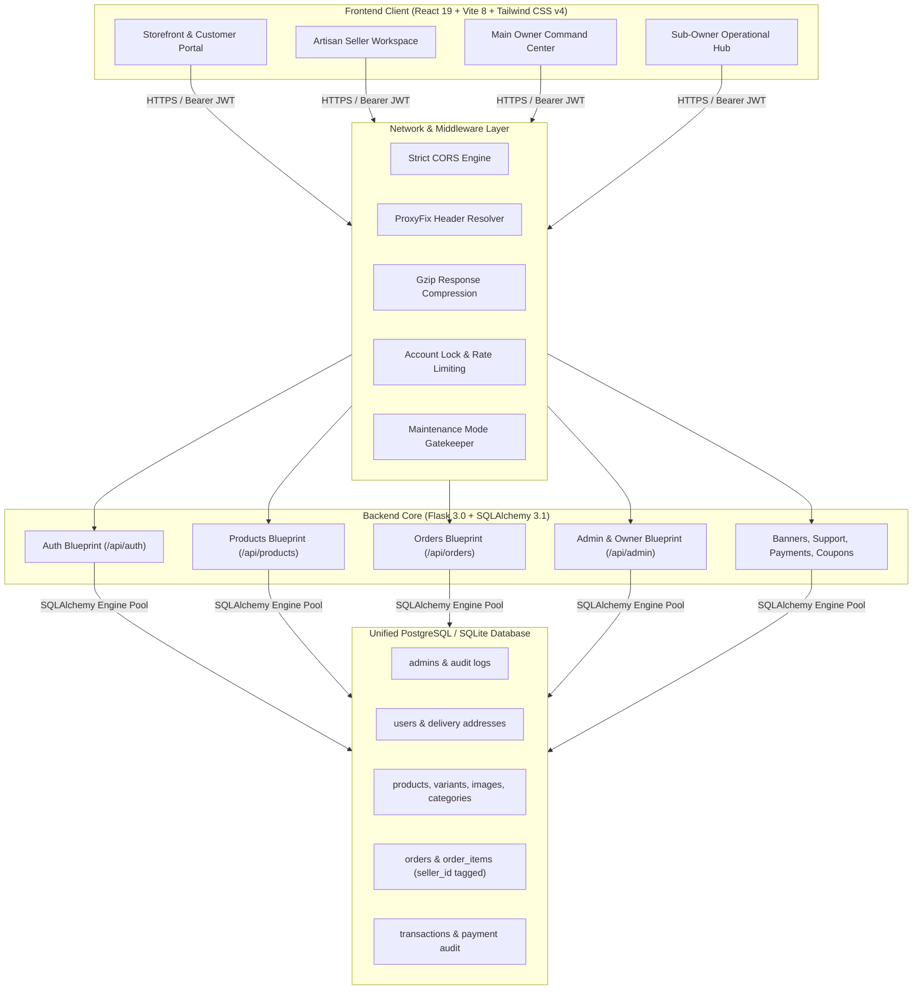

# CraftNest — Technical Documentation & Knowledge Base

Welcome to the comprehensive technical documentation for **CraftNest**, an enterprise-grade multi-role artisanal handicraft marketplace platform built with a high-performance modern web stack.

---

## 📖 Documentation Directory Index

This documentation suite provides an exhaustive, verifiable, code-accurate technical blueprint of the CraftNest application. Every specification is referenced directly against the active implementation in the codebase.

| Document | Purpose | Key Contents |
| :--- | :--- | :--- |
| **⭐ [CRAFTNEST_COMPLETE_TECHNICAL_DOCUMENTATION.md](./CRAFTNEST_COMPLETE_TECHNICAL_DOCUMENTATION.md)** | **Single Master Document** | **All 15 sections consolidated into one single standalone documentation file** |
| **[PROJECT_OVERVIEW.md](./PROJECT_OVERVIEW.md)** | Executive & Architectural Summary | Mission, problem statement, target personas, platform capabilities |
| **[TECH_STACK.md](./TECH_STACK.md)** | Technology Inventory & Dependencies | Exact package versions, runtime engines, libraries, styling system |
| **[PROJECT_STRUCTURE.md](./PROJECT_STRUCTURE.md)** | Repository Hierarchy & Directory Map | Annotated file tree, component purposes, inter-file dependency linkages |
| **[DATABASE_DOCUMENTATION.md](./DATABASE_DOCUMENTATION.md)** | Schema Architecture & ER Modeling | Complete table schemas, fields, constraints, relations, Mermaid ER diagrams |
| **[API_DOCUMENTATION.md](./API_DOCUMENTATION.md)** | Comprehensive RESTful API Reference | Endpoint tables, headers, request/response JSON payloads, status codes |
| **[AUTHENTICATION_AND_ROLES.md](./AUTHENTICATION_AND_ROLES.md)** | Identity, Authorization & RBAC | Multi-role authentication (Owner, Seller, Sub-Owner, Customer), JWT, OTP |
| **[FRONTEND_DOCUMENTATION.md](./FRONTEND_DOCUMENTATION.md)** | Client-Side Architecture & Components | React pages, routing table, modals, responsive navigation, contexts |
| **[BACKEND_DOCUMENTATION.md](./BACKEND_DOCUMENTATION.md)** | Server Architecture & Middlewares | Flask blueprints, middleware filters, concurrency locks, background tasks |
| **[DATA_FLOW.md](./DATA_FLOW.md)** | Visual Workflows & Sequence Modeling | 6+ Mermaid sequence and flowchart diagrams of critical application flows |
| **[SECURITY_DOCUMENTATION.md](./SECURITY_DOCUMENTATION.md)** | Security Architecture & Protections | AES-256-CBC field encryption, bcrypt, JWT verification, rate limits, CORS |
| **[ENVIRONMENT_VARIABLES.md](./SECURITY_DOCUMENTATION.md#environment-variables)** | Environment Variable Catalog | Safe placeholders, operational purposes, defaults, and requirements |
| **[IMPLEMENTATION_STATUS.md](./IMPLEMENTATION_STATUS.md)** | Feature Verification & Gap Audit | Status matrix of implemented, partial, and planned capabilities |
| **[SETUP_GUIDE.md](./SETUP_GUIDE.md)** | Local Development & Deployment Guide | Step-by-step installation, environment setup, database bootstrap, execution |

---

## ⚡ Quick Architecture Summary



---

## 🔑 Key Architectural Highlights

1. **Unified Database with Relational Tenant Isolation**:
   - The platform uses a **single Neon PostgreSQL database** (or local SQLite in dev mode).
   - Sellers are **not** segregated across separate physical databases. Instead, relational isolation is enforced through `seller_id` foreign keys on `products` and `order_items`, with query-level enforcement in models and controllers.
2. **Deterministic AES-256-CBC Field-Level Encryption**:
   - Highly sensitive PII (patron full names, emails, mobile numbers, delivery street addresses, and order shipping details) is encrypted before persistence in Neon PostgreSQL using deterministic IV cryptography, allowing exact lookups while preventing plaintext exposure.
3. **Single Unified Entry Authentication**:
   - Both administrators, artisans, and customers utilize a unified login flow (`/login`), where the backend resolves identity, bcrypt hash, and role hierarchy, returning a role-scoped JWT token and triggering automatic frontend routing to the correct portal.
4. **Resilient Concurrency & Deadlock Prevention**:
   - Checkout processes sort product IDs before executing row-level locks (`with_for_update()`), ensuring high-concurrency order placement without database deadlocks.

---

## 🚀 Quick Start (Local Environment)

### Prerequisites
- Node.js (v18+ recommended)
- Python (v3.10+ recommended)
- PostgreSQL (or local SQLite)

### 1. Backend Setup
```bash
cd backend
python3 -m venv venv
source venv/bin/activate
pip install -r requirements.txt

# Create .env from template (refer to SETUP_GUIDE.md)
flask --app app.py bootstrap-dev
python app.py
```
*Backend runs at `http://localhost:5005`.*

### 2. Frontend Setup
```bash
cd frontend
npm install
npm run dev
```
*Frontend runs at `http://localhost:5173`.*

---

For thorough technical analysis of each subsystem, consult the linked documentation files above.
