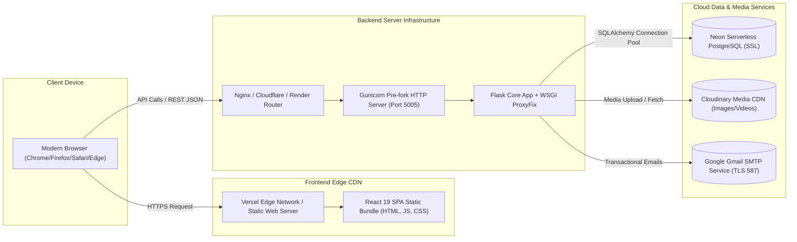

# CraftNest — Technology Stack & Dependencies

This document provides a verified, comprehensive inventory of all technologies, libraries, frameworks, programming languages, and specific package versions utilized across the CraftNest platform.

---

## 1. Frontend Technology Stack

The client-side interface is an optimized Single Page Application (SPA) designed with a luxury, craft-oriented aesthetic.

| Layer | Technology | Version | Purpose & Implementation Details |
| :--- | :--- | :--- | :--- |
| **Core Framework** | React | `^19.2.6` | Component-based modern UI rendering with React 19 concurrent features. |
| **DOM Renderer** | React DOM | `^19.2.6` | Client-side DOM binding and reconciliation. |
| **Build & Dev Tool** | Vite | `^8.0.12` | High-speed ESM development server and Rollup production bundler. |
| **Language** | JavaScript (ESM / JSX) | ES2023+ | Native modern JavaScript modules without TypeScript overhead. |
| **Styling Framework** | Tailwind CSS | `^4.3.0` | Utility-first CSS using the next-generation Tailwind v4 engine (`@tailwindcss/vite`). |
| **CSS Preprocessing** | PostCSS & Autoprefixer | `^8.5.15` / `^10.5.0` | Vendor prefixing and custom CSS processing. |
| **Design System** | Custom Vanilla CSS | — | Handcrafted tokens in `index.css` & `App.css` defining warm cream backgrounds, rich terracotta hues, gold accents, and serif typography. |
| **Iconography** | Lucide React | `^1.16.0` | Clean, modern SVG icon set for navigation, actions, indicators, and status badges. |
| **Client Routing** | React Router DOM | `^7.15.1` | Declarative client-side routing, route parameters, protected route wrappers, and navigation guards. |
| **Animations & Transitions**| Framer Motion | `^12.40.0` | Fluid page transitions, modal overlays, accordions, and layout animations. |
| **Motion Physics** | GSAP | `^3.15.0` | High-performance timeline animations for hero and showcase sections. |
| **HTTP Client** | Axios | `^1.16.1` | Promise-based API communication with centralized request/response interceptors in `frontend/src/api/client.js`. |
| **State Management** | React Context API | Native | Lightweight, domain-segregated global state: `AuthContext`, `CartContext`, `WishlistContext`, `MaintenanceContext`, `HighDemandContext`. |
| **Code Splitting** | Vite / Rollup Chunking | Custom | Configured manual chunks in `vite.config.js`: `vendor-react`, `vendor-lucide`, `vendor-framer-motion`, `vendor-axios`, `vendor-libs`. |

### Frontend Development Dependencies
- `@vitejs/plugin-react`: `^6.0.1` — Official Babel/SWC fast refresh plugin for Vite.
- `@tailwindcss/vite`: `^4.3.0` — Zero-configuration Vite plugin for Tailwind v4.
- `eslint`: `^10.3.0` — Code quality and linter engine.
- `eslint-plugin-react-hooks`: `^7.1.1` — Enforces rules of React Hooks.
- `eslint-plugin-react-refresh`: `^0.5.2` — Validates components for hot-module reloading.

---

## 2. Backend Technology Stack

The backend application is an enterprise RESTful service developed with Python and Flask, utilizing blueprint-modularized endpoints and robust transactional handling.

| Component | Technology | Version | Purpose & Implementation Details |
| :--- | :--- | :--- | :--- |
| **Language Runtime** | Python | `>= 3.10` | High-level typed server execution engine. |
| **Web Framework** | Flask | `3.0.3` | Lightweight, unopinionated WSGI microframework powering the REST API. |
| **WSGI Middleware** | Werkzeug ProxyFix | Bundled with Flask | Fixes `X-Forwarded-*` headers behind reverse proxies (Render, Cloudflare, Oracle Cloud, Nginx). |
| **API Architecture** | Flask Blueprints | Native | Modular separation of concerns into 14 domain-specific blueprints under `/api/*`. |
| **ORM Layer** | Flask-SQLAlchemy | `3.1.1` | Object-Relational Mapping providing declarative models, relationship navigation, and transactional locking. |
| **Database Migrations** | Flask-Migrate | `4.1.0` | Schema change tracking and automated migration execution using Alembic. |
| **PostgreSQL Driver** | psycopg2-binary | Latest | High-performance C-extension driver for Neon PostgreSQL connections. |
| **MySQL Driver (Fallback)**| PyMySQL | `1.2.0` | Pure-Python MySQL connector available for cross-platform fallback. |
| **SQLite Driver** | sqlite3 | Python Standard | Embedded database engine used for rapid zero-dependency local development (`backend/dev.db`). |
| **Authentication & Tokens**| PyJWT | `2.8.0` | Cryptographic issuance and validation of JSON Web Tokens using HMAC-SHA256 (HS256). |
| **Password Security** | bcrypt | `4.1.3` | Adaptive key-derivation password hashing with unique salts. |
| **Field-Level Encryption** | cryptography | `48.0.0` | AES-256-CBC cipher with deterministic IV generation for PII protection. |
| **CORS Middleware** | Flask-Cors | `4.0.1` | Exact-origin CORS validation with credential support (`Access-Control-Allow-Credentials: true`). |
| **Email Service** | flask_mail / smtplib | Bundled / Python Std | Gmail SMTP integration (`smtp.gmail.com:587` with TLS) for transactional OTPs, receipts, and buy requests. |
| **Cloud Media Storage** | cloudinary | `1.40.0` | Cloudinary REST SDK for uploading, transforming, and serving high-resolution product media. |
| **Data Analytics Engine** | pandas | Latest | Aggregation and computation of monthly sales, GMV metrics, and artisan breakdowns. |
| **Report Generation** | openpyxl | Latest | Automated Excel spreadsheet generation for operational reports (`.xlsx`). |
| **Visual Charting** | matplotlib | Latest | Server-side chart plotting for automated administrative report attachments. |
| **Timezone Management** | pytz | Latest | Strict localization to India Standard Time (`Asia/Kolkata` / UTC+05:30). |
| **Environment Config** | python-dotenv | `1.0.1` | Automated parsing and loading of `.env` files. |
| **Production Server** | gunicorn | `22.0.0` | Pre-fork worker WSGI HTTP server for production deployment. |

---

## 3. Database Architecture & Technologies

| Dimension | Specification | Notes |
| :--- | :--- | :--- |
| **Primary Production Database** | **Neon PostgreSQL** (Serverless) | Cloud-native serverless PostgreSQL with branch management, auto-scaling, and SSL encryption. |
| **Development Database** | **SQLite 3** (`backend/dev.db`) | Automatically provisioned fallback when `ENVIRONMENT=DEV` and no PostgreSQL URI is supplied. |
| **Connection Protocol** | `postgresql://` or `postgresql+psycopg2://` | Automatically normalizes legacy `postgres://` connection strings to standard SQLAlchemy dialect. |
| **SSL Mode** | Required (`sslmode=require`) | Mandatory for Neon connections in QA and Production to prevent unencrypted transit. |
| **Connection Pooling** | SQLAlchemy Engine Pool | Pre-ping enabled (`pool_pre_ping=True`), recycling at 280s (`pool_recycle=280`), pool size 10 with max overflow 5. |
| **Tenant Isolation Strategy** | **Relational Foreign Key Isolation** | **Crucial verification**: There are *no separate databases* for Owner vs Sellers. A single database is used; isolation is enforced via `seller_id` on products and order items. |

---

## 4. Deployment & Infrastructure Profile

- **Frontend Hosting Target**: Vercel (configured via `frontend/vercel.json` with wildcard catch-all rewrites: `/(.*) -> /index.html`) or Render Static Sites.
- **Backend Hosting Target**: Render Web Services or Linux VPS executing `gunicorn backend.app:app --bind 0.0.0.0:5005`.
- **Database Hosting Target**: Neon PostgreSQL (`*.neon.tech`).
- **Media CDN**: Cloudinary Media Library with static fallback to `backend/static/uploads/`.
- **Email Gateway**: Google Gmail SMTP (`smtp.gmail.com:587`).
